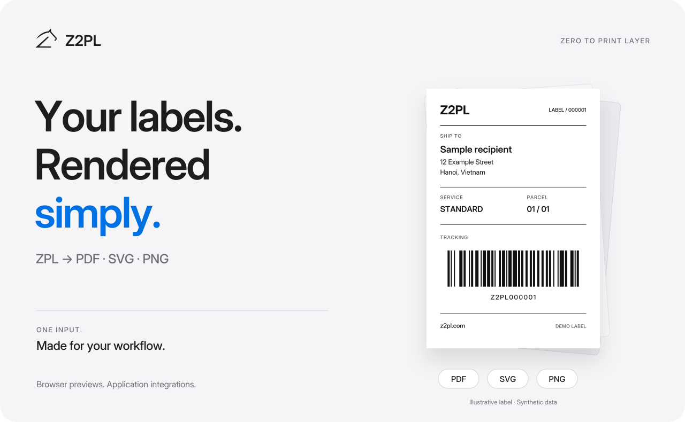
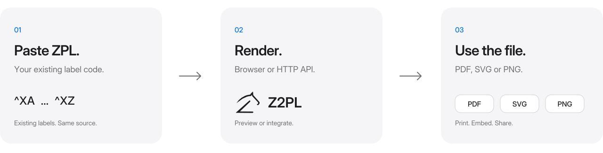
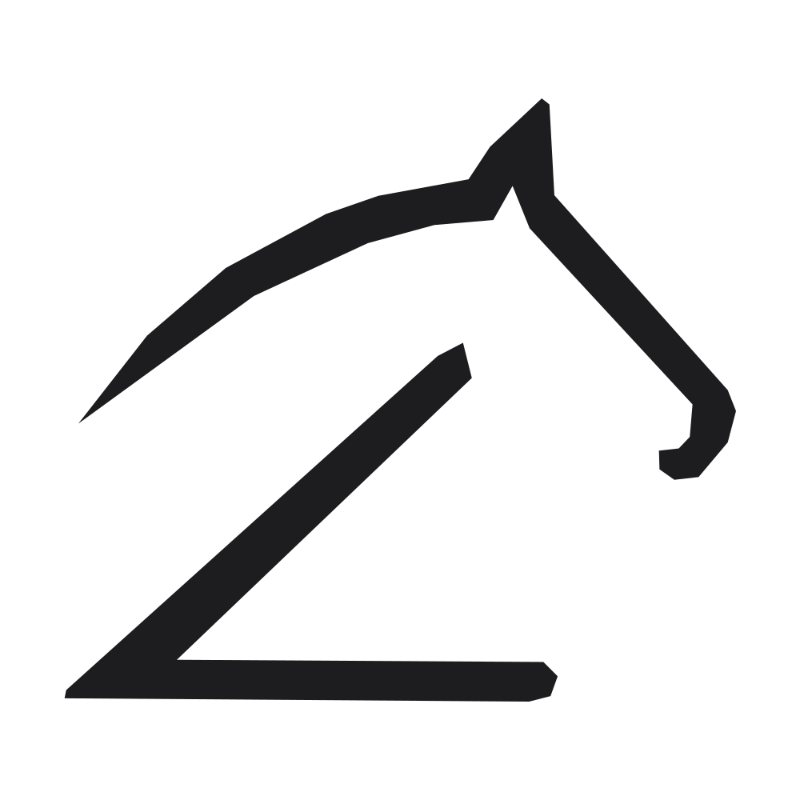

<!-- Product showcase, not the renderer source repository. -->
<!-- Keep assets/readme/ beside this file. All visual assets are local. -->

<p align="center">
  <a href="https://z2pl.com/">
    <picture>
      <source media="(max-width: 640px) and (prefers-color-scheme: dark)" srcset="./assets/readme/hero-mobile-dark.svg">
      <source media="(max-width: 640px)" srcset="./assets/readme/hero-mobile-light.svg">
      <source media="(prefers-color-scheme: dark)" srcset="./assets/readme/hero-dark.svg">
      <source media="(prefers-color-scheme: light)" srcset="./assets/readme/hero-light.svg">
      
    </picture>
  </a>
</p>

<p align="center">
  <strong>One HTTP request converts labels to PDF, SVG or PNG.</strong>
</p>

<p align="center">
  <a href="https://z2pl.com/playground/">
    <picture>
      <source media="(prefers-color-scheme: dark)" srcset="./assets/readme/button-playground-dark.svg">
      
    </picture>
  </a>
  &nbsp;
  <a href="https://z2pl.com/docs/">
    <picture>
      <source media="(prefers-color-scheme: dark)" srcset="./assets/readme/button-docs-dark.svg">
      
    </picture>
  </a>
</p>

<p align="center">
  <a href="#one-input-three-useful-formats">Output formats</a> &nbsp;·&nbsp;
  <a href="#start-with-a-label">Quick start</a> &nbsp;·&nbsp;
  <a href="https://z2pl.com/pricing/">Pricing</a> &nbsp;·&nbsp;
  <a href="#help-the-next-label-render-better">Feedback</a>
</p>

<br>

## Keep the ZPL. Lose the friction.

**Z2PL** turns Zebra Programming Language into files you can preview, print, embed or share. Keep the label code your system already generates. Add the output your workflow needs.

Try a label in the browser, or connect rendering to your application over HTTP. You do not need a physical label printer to convert it.

<picture>
  <source media="(max-width: 640px) and (prefers-color-scheme: dark)" srcset="./assets/readme/workflow-mobile-dark.svg">
      <source media="(max-width: 640px)" srcset="./assets/readme/workflow-mobile-light.svg">
      <source media="(prefers-color-scheme: dark)" srcset="./assets/readme/workflow-dark.svg">
  <source media="(prefers-color-scheme: light)" srcset="./assets/readme/workflow-light.svg">
  
</picture>

<br>

## One input. Three useful formats.

<table>
  <tr>
    <td width="33%" valign="top">
      <h3>PDF</h3>
      <p><strong>For the next step.</strong></p>
      <p>Turn labels into documents for printing, sharing and archiving.</p>
    </td>
    <td width="33%" valign="top">
      <h3>SVG</h3>
      <p><strong>For a closer look.</strong></p>
      <p>Use vector output in a browser, a product interface or a scalable layout.</p>
    </td>
    <td width="33%" valign="top">
      <h3>PNG</h3>
      <p><strong>For anywhere an image fits.</strong></p>
      <p>Add raster previews to dashboards, thumbnails and image-based workflows.</p>
    </td>
  </tr>
</table>

Text, supported barcodes and geometry use vector primitives in PDF and SVG. Embedded bitmap artwork remains raster; PNG is raster output.

[Explore formats and conversion options →](https://z2pl.com/docs/#formats)

<br>

## Start with a label.

Open the [playground](https://z2pl.com/playground/), paste the sample below, choose an output format and convert.

```zpl
^XA
^PW812
^LL1218
^FO64,80^A0N,54,54^FDHello from Z2PL^FS
^FO64,180^BY3
^BCN,150,Y,N,N^FDZ2PL000001^FS
^XZ
```

[Simple sample](./examples/hello-world.zpl) &nbsp;·&nbsp; [Shipping-style sample](./examples/showcase-label.zpl) &nbsp;·&nbsp; [API quickstart](https://z2pl.com/docs/#quickstart)

<sub>The header uses a label illustration with synthetic data, not a captured API response. Use the playground to check the actual rendering of your ZPL.</sub>

<br>

## A small step in a bigger workflow.

**Preview before printing.** Inspect a generated label during development or before sending it to a physical printer.

**Bring labels into your application.** Show previews beside orders, inventory or shipments without asking users to read raw ZPL.

**Connect the systems you already use.** Add a conversion step to your backend, ERP or warehouse workflow, then store or deliver the resulting file.

<details>
<summary><strong>For developers: integration and rendering details</strong></summary>

### HTTP, not another SDK dependency.

Send ZPL from the HTTP client your application already uses. Read the documentation for authentication, output options and response handling before integrating.

### Vector where it matters.

The Rust rendering core draws text, supported barcodes and geometry as primitives in vector outputs. Bitmap content is not automatically converted into vector artwork.

### Reproducible conversion.

For the same input and conversion parameters, Z2PL documents deterministic output. When comparing results, keep the renderer version, configuration, fonts and assets consistent.

[Authentication](https://z2pl.com/docs/#authentication) · [Output formats](https://z2pl.com/docs/#formats) · [Errors](https://z2pl.com/docs/#errors) · [Supported ZPL](https://z2pl.com/docs/#zpl)

</details>

<details>
<summary><strong>Compatibility: what to check before production</strong></summary>

ZPL support is command- and feature-dependent. A renderer is not a complete emulation of every printer, firmware version or device-management operation.

Test representative labels, fonts, embedded images, barcode data and dimensions for your workflow. Validate barcode scans and the final physical print where those are operational requirements.

Check the [supported ZPL reference](https://z2pl.com/docs/#zpl) for current behavior. Report differences with a small, reproducible sample rather than assuming universal printer parity.

</details>

<br>

## Help the next label render better.

Real labels reveal the edge cases. Report a rendering difference, request a missing capability or describe an integration that would make Z2PL more useful.

**[Report a rendering issue →](https://github.com/bot-nosense/z2pl.com/issues/new?template=rendering-report.yml)** &nbsp;&nbsp; **[Suggest an improvement →](https://github.com/bot-nosense/z2pl.com/issues/new?template=feature-request.yml)**

A useful report includes the smallest ZPL sample that reproduces the issue, the output format and dimensions, and the expected versus actual result. Include DPI, fonts or printer details when relevant.

**Use synthetic data.** Remove customer names, addresses, real tracking identifiers, credentials and other sensitive information before posting. GitHub issues in this repository are public.

<details>
<summary><strong>About this repository</strong></summary>

This is the public product showcase for **Z2PL — Zero to Print Layer**. It contains product information, visual assets, example labels and feedback templates. It does **not** contain the rendering engine source code.

A public showcase repository does not imply an open-source release of the service or engine. See the website for current product access, documentation and terms.

</details>

<br>

---

<p align="center">
  <a href="https://z2pl.com/">
    <picture>
      <source media="(prefers-color-scheme: dark)" srcset="./assets/readme/brand-dark.svg">
      
    </picture>
  </a>
</p>

<p align="center">
  <strong>Rendered simply. Nothing more.</strong><br>
  <sub>Z2PL — Zero to Print Layer</sub>
</p>

<p align="center">
  <a href="https://z2pl.com/">Website</a> &nbsp;·&nbsp;
  <a href="https://z2pl.com/playground/">Playground</a> &nbsp;·&nbsp;
  <a href="https://z2pl.com/docs/">Documentation</a> &nbsp;·&nbsp;
  <a href="https://z2pl.com/pricing/">Pricing</a>
</p>
